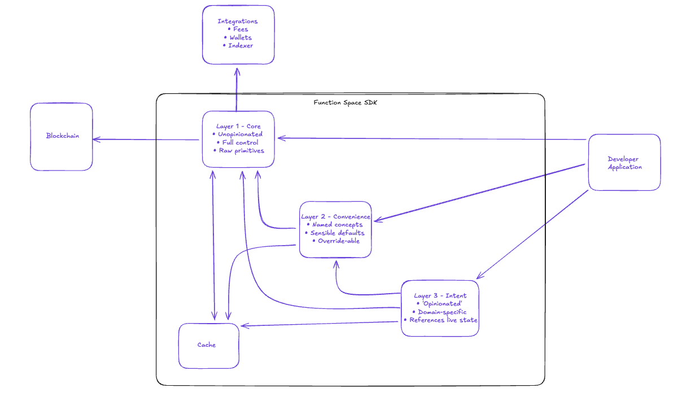

# Architecture

The functionSPACE SDK is designed around two orthogonal organisational principles: **Layers** determine abstraction level, while **Categories** determine functional domain. This separation allows developers to work at their preferred level of control while maintaining clear boundaries between different types of operations.

### Layer Model

The SDK uses a layered architecture where higher layers compose lower layers. Developers can enter at any layer depending on their needs. Those wanting full control work at L1, while those preferring convenience work at L2 or L3.

#### When to Use Each Layer

**L1: Full Control** Use L1 when you need precise control over every parameter, are building novel interfaces not anticipated by convenience functions, or want to minimise abstraction overhead. L1 functions are unopinionated, they do exactly what you specify, nothing more.

**L2: Common Patterns** Use L2 for typical development workflows. These functions encode best practices and sensible defaults while remaining overridable. Most applications will primarily use L2 functions.

**L3: User Intent** Use L3 when building end-user interfaces where the developer thinks in terms of user goals rather than protocol mechanics. L3 functions may read live state, make multiple internal calls, and orchestrate complex workflows. They are opinionated by design.

<table><thead><tr><th width="89.28515625">Layer</th><th width="132.69921875">Name</th><th width="278.53125">Description</th><th>Example</th></tr></thead><tbody><tr><td>L0</td><td>Pure Math</td><td>Protocol-agnostic mathematical operations. No awareness of markets or positions.</td><td><code>evaluateDensity()</code>, <code>evaluatePotential()</code></td></tr><tr><td>L1</td><td>Core</td><td>Direct protocol interactions with full parameter control. Unopinionated and explicit.</td><td><code>buy()</code>, <code>queryMarketState()</code>, <code>generateBelief()</code></td></tr><tr><td>L2</td><td>Convenience</td><td>Higher-level wrappers with sensible defaults. Named concepts that map to common use cases.</td><td><code>generateGaussian()</code>, <code>projectBuy()</code>, <code>queryClaimShare()</code></td></tr><tr><td>L3</td><td>Intent</td><td>Domain-specific functions driven by user intent. May reference live market state and orchestrate across categories.</td><td><code>generateBinary()</code>, <code>claimAll()</code>, <code>discoverTrending()</code></td></tr></tbody></table>

<figure><figcaption></figcaption></figure>

### Category Organisation

Categories group functions by what they do, independent of their abstraction layer. A category can contain functions at L1, L2, and L3.&#x20;

<table><thead><tr><th>Category</th><th>What It Does</th><th width="186.0546875">Examples</th><th>Notes</th></tr></thead><tbody><tr><td><strong>Transactions</strong></td><td>Writes to the chain; state-changing operations</td><td><code>buy()</code>, <code>sell()</code>, <code>createMarket()</code>, <code>updatePosition()</code></td><td>Require wallet signature</td></tr><tr><td><strong>Positions</strong></td><td>Pure computation; transforms inputs into protocol-ready formats</td><td><code>generateGaussian()</code>, <code>generatePlateau()</code>, <code>generateBelief()</code></td><td>No chain interaction; human interface to compose beliefs </td></tr><tr><td><strong>Projections</strong></td><td>Computes hypothetical outcomes without chain interaction</td><td><code>projectBuy()</code>, <code>projectPayout()</code>, <code>projectSell()</code></td><td>Read current state, simulate results</td></tr><tr><td><strong>Queries</strong></td><td>Reads and interprets current protocol state</td><td><code>queryMarketState()</code>, <code>queryClaimShare()</code>, <code>queryConsensusSummary()</code></td><td>On-chain reads</td></tr><tr><td><strong>Discovery</strong></td><td>Find and filter markets or positions</td><td><code>discoverMarkets()</code>, <code>discoverTrending()</code>, <code>discoverUserPositions()</code></td><td>Requires indexer</td></tr></tbody></table>

#### Category Behaviour Patterns

**Transactions** are the only category that modifies on-chain state. They require a wallet connection and user signature. All other categories are read-only or pure computation.

**Position** generators are entirely local, they transform human-readable parameters into valid belief expression  vectors without any network calls. Their may output feeds into Transactions and Projections.

**Projections** read current state and compute hypothetical outcomes. They answer "what if" questions: what happens if I buy, what do I receive if I sell, what is my payout at outcome X. They never modify state.

**Queries** read current on-chain state directly. They return facts about markets and positions as they exist now. With the potential to power unique and dynamic interaction points

**Discovery** functions query an off-chain indexer rather than the blockchain directly. They enable filtering, sorting, and pagination across markets and positions. Operations that are impractical on-chain.

### Example Data flow

<figure><figcaption></figcaption></figure>

The above is an example of how the a single function will call upon one or many lower layer functions traversing the many functional layers that are composed and checked within a PayoutDesign function.

This is one of many complex scenarios that the SDK abstracts away, developers simply pass the user input and the system will convert it to a viable belief vector ready for on chain submission.

The diagram shows a concrete example of layer interaction when a developer wants to create a position targeting a minimum payout. This workflow crosses multiple categories (Positions, Projections, Transactions) and multiple layers (L1, L2, L3).

**Starting Point: Developer Intent (Layer 3)** The developer specifies a goal: "I want at least $X payout if the outcome falls between L and H." This enters at the Payout Design row, Layer 3. The L3 function doesn't directly generate shapes or submit transactions—it orchestrates lower layers to achieve the goal.

**Shape Construction (Layers 2 → 1)** The L3 Payout Design function calls the L2 "Plateau shape" generate to request an appropriate belief shape covering the target range. The L2 generators in turn calls L1 "Raw Shape generation" to produce the actual Bernstein coefficients. This is the Belief row flowing from L3 → L2 → L1.

**Settlement Projection (Layer 2)** The Projection row shows how the system validates the proposed position. L2 "Settlement values between L-H" computes what payout this shape would produce at various outcomes within the target range. This requires market state, which comes from the Cache.

**Iterative Refinement Loop** The grey arrow labeled "Return Iterative Values (Confirm Validity)" shows the feedback loop. Projection results return to Payout Design for validation. If the computed payout doesn't meet the target, L3 adjusts parameters (typically collateral amount) and repeats the projection. This continues until the goal is met or determined impossible.

**Transaction Submission (Layer 1)** Once a valid configuration is found, the flow descends to Core layer. The arrow labeled "If Values Are Acceptable" leads to "Submit Buy" at L1, which writes the position to the blockchain.

**Cache Integration** The Cache box at top provides market state to the projection calculations without requiring fresh chain reads on each iteration. This makes the iterative refinement process performant.

