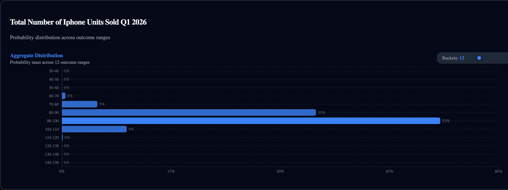

# DistributionChart

**`DistributionChart`**

Horizontal bar chart showing probability mass by outcome bucket. Includes an interactive bucket count slider (range 2–50).

```tsx
import { DistributionChart } from '@functionspace/ui';
```

<figure><figcaption></figcaption></figure>

**CSS class:** `fs-chart-container`

**Props:**

| Prop                 | Type                | Default  | Description                                                                                      |
| -------------------- | ------------------- | -------- | ------------------------------------------------------------------------------------------------ |
| `marketId`           | `string \| number`  | required | Market to display                                                                                |
| `height`             | `number`            | `300`    | Chart height in pixels                                                                           |
| `defaultBucketCount` | `number`            | `12`     | Initial bucket count (2–50)                                                                      |
| `distributionState`  | `DistributionState` | --       | External shared state. When provided, the chart's bucket count slider controls the shared state. |

**Renders:**

* **Sub-header:** Title "Aggregate Distribution", subtitle with bucket count, and interactive range slider (2–50).
* **Horizontal bar chart:** Vertical layout (`BarChart layout="vertical"`). Each bar represents one outcome bucket. Bars use `chartColors.consensus` with the peak bucket at full opacity (1.0) and others at 0.8. Percentage labels render to the right of each bar.
* **Custom tooltip:** Shows "Range: {range} {units}" and "Probability: {percentage}%". Units suffix is only displayed when `market.xAxisUnits` is truthy.

**Behavior:**

* **Smart bucket decimals:** Bucket range labels automatically use integer formatting when bucket width ≥ 1, or `market.decimals` precision for narrow buckets.
* **Bucket count slider:** Allows interactive adjustment (2–50). When `distributionState` is provided, the slider controls the shared state; otherwise it controls internal state.
* **Loading/error:** Renders "Loading consensus data..." or "Error: {message}" inline.

**Context interactions:**

* **Reads:** `ctx.chartColors` (bar fill, grid, axis, tooltip colors)
* **Writes:** None

**Internal calls:** `useMarket`, `useConsensus`, `calculateBucketDistribution`

**Example:**

```tsx
<FunctionSpaceProvider config={config} theme="fs-dark">
  <DistributionChart marketId={42} height={250} defaultBucketCount={8} />
</FunctionSpaceProvider>
```

**Related:** `BucketRangeSelector` (sync via shared `DistributionState`) | `BucketTradePanel` (composite) | `calculateBucketDistribution` (core math)

***
