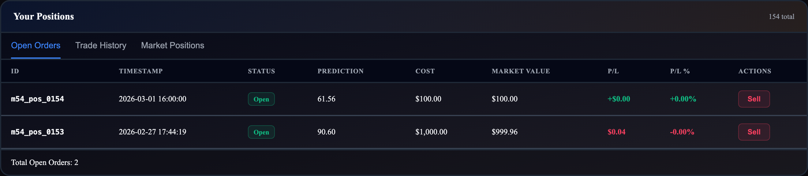

# PositionTable

**`PositionTable`**

Paginated data table for viewing and managing positions. Supports three tab views, real-time market value lookup via `projectSell`, inline sell actions, and row selection that coordinates with chart overlays.

```tsx
import { PositionTable } from '@functionspace/ui';
```

<figure><figcaption></figcaption></figure>

**CSS class:** `fs-table-container`

**Props:**

<table><thead><tr><th width="162.125">Prop</th><th width="203.171875">Type</th><th width="125.30078125">Default</th><th>Description</th></tr></thead><tbody><tr><td><code>marketId</code></td><td><code>string | number</code></td><td>required</td><td>Market to display positions for</td></tr><tr><td><code>username</code></td><td><code>string</code></td><td>required</td><td>Authenticated username (filters positions and enables "(you)" highlighting)</td></tr><tr><td><code>tabs</code></td><td><code>PositionTabId[]</code></td><td><code>['open-orders', 'trade-history']</code></td><td>Which tabs to show. Tab bar hidden when only one tab.</td></tr><tr><td><code>pageSize</code></td><td><code>number</code></td><td><code>20</code></td><td>Rows per page</td></tr><tr><td><code>selectedPositionId</code></td><td><code>number | null</code></td><td>--</td><td>Controlled selection: externally managed selected position ID</td></tr><tr><td><code>onSelectPosition</code></td><td><code>(id: number | null) => void</code></td><td>--</td><td>Controlled selection callback. When provided, row clicks call this instead of writing to <code>ctx.setSelectedPosition</code>.</td></tr><tr><td><code>onSell</code></td><td><code>(result: SellResult) => void</code></td><td>--</td><td>Called after successful sell</td></tr></tbody></table>

**Tabs and columns:**

<table><thead><tr><th width="192.67578125">Tab ID</th><th width="170.00390625">Label</th><th>Columns</th></tr></thead><tbody><tr><td><code>open-orders</code></td><td>Open Orders</td><td>ID, Timestamp, Status, Prediction, Cost, Market Value, P/L, P/L%, Actions</td></tr><tr><td><code>trade-history</code></td><td>Trade History</td><td>ID, Timestamp, Status, Prediction, Cost, Sold Value, P/L, P/L%, Resolution Payout</td></tr><tr><td><code>market-positions</code></td><td>Market Positions</td><td>ID, Timestamp, Owner, Status, Prediction, Cost, Sold Value, Market Value, P/L</td></tr></tbody></table>

**Behavior:**

* **Row selection (two modes):**
  * **Uncontrolled** (no `onSelectPosition`): Clicking a row writes the position to `ctx.setSelectedPosition`, causing `ConsensusChart` to render the position's belief as a colored overlay. Clicking the selected row again deselects it.
  * **Controlled** (`onSelectPosition` provided): Clicking a row calls `onSelectPosition(id)`. Selection state is determined by the `selectedPositionId` prop, falling back to `ctx.selectedPosition?.positionId` when `selectedPositionId` is not provided.
* **Per-tab pagination:** Each tab maintains its own page number independently. Pages auto-reset to 1 when tab data count changes.
* **Market value lookup:** For visible open positions (current page only), `projectSell` is called via `Promise.allSettled` for resilient fetching. Values are cached and update when the page changes.
* **Sell flow:** The "Sell" button (open-orders tab, open positions only) calls `sell()`, then `ctx.invalidate(marketId)` and `refetch()`. Shows "Selling..." during the operation. Sell errors display as a banner above the table.
* **P/L calculation (priority order):** 1) Sold/closed positions with a non-null `soldPrice`: `soldPrice - collateral`. 2) Any remaining position with a non-null `settlementPayout`: `settlementPayout - collateral`. 3) Open positions: `marketValue - collateral` (from `projectSell`). Note: sold/closed positions with a `soldPrice` always use path 1, even if they also have a `settlementPayout`. P/L% = `(P/L / collateral) * 100`.
* **Owner highlighting:** In the `market-positions` tab, the authenticated user's rows show "(you)" next to the username.
* **Sorting:** All tab data is sorted by position ID descending.
* **Loading/error:** Renders a spinner with "Loading positions..." or an error message with a "Retry" button. Empty states show contextual messages per tab.

**Context interactions:**

* **Reads:** `ctx.client`, `ctx.selectedPosition?.positionId` (for uncontrolled selection highlighting)
* **Writes:** `ctx.setSelectedPosition(position | null)` (uncontrolled mode only)
* **Triggers:** `ctx.invalidate(marketId)` after successful sell

**Internal calls:** `usePositions`, `projectSell`, `sell`

**Example:**

```tsx
<FunctionSpaceProvider config={config} theme="fs-dark">
  <PositionTable marketId={42} username="trader1" />
</FunctionSpaceProvider>
```

```tsx
<PositionTable
  marketId={42}
  username="trader1"
  tabs={['open-orders', 'trade-history', 'market-positions']}
  pageSize={10}
  onSell={(result) => console.log('Sold, returned:', result.collateralReturned)}
/>
```

**Related:** `ConsensusChart` (reads `selectedPosition` for overlay) | `usePositions` (data hook) | `projectSell`, `sell` (core functions)

***
