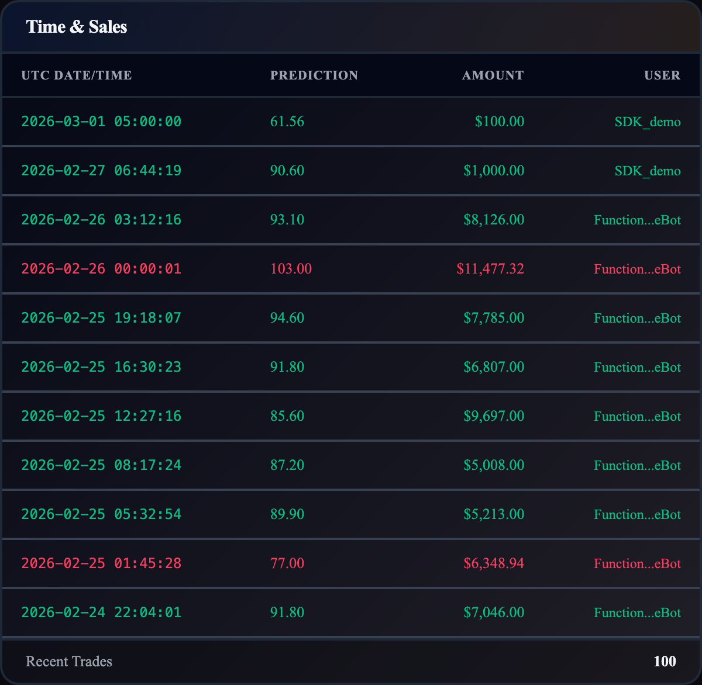

# TimeSales

**`TimeSales`**

Live scrollable feed of recent market trades with automatic polling.

```tsx
import { TimeSales } from '@functionspace/ui';
```

<figure><figcaption></figcaption></figure>

**CSS class:** `fs-time-sales`

**Props:**

<table><thead><tr><th width="160.77734375">Prop</th><th width="168.90625">Type</th><th width="167.328125">Default</th><th>Description</th></tr></thead><tbody><tr><td><code>marketId</code></td><td><code>string | number</code></td><td>required</td><td>Market to display trades for</td></tr><tr><td><code>maxHeight</code></td><td><code>string</code></td><td><code>'500px'</code></td><td>Scrollable container max-height</td></tr><tr><td><code>limit</code></td><td><code>number</code></td><td><code>100</code></td><td>Maximum trades to fetch</td></tr><tr><td><code>pollInterval</code></td><td><code>number</code></td><td><code>5000</code></td><td>Polling interval in ms (0 to disable)</td></tr><tr><td><code>showFooter</code></td><td><code>boolean</code></td><td><code>true</code></td><td>Show "Recent Trades" footer with count badge</td></tr><tr><td><code>emptyMessage</code></td><td><code>string</code></td><td><code>'No market activity yet'</code></td><td>Custom empty state text</td></tr></tbody></table>

**Renders:**

* **Header:** "Time & Sales" heading.
* **Table columns:** UTC Date/Time, Prediction, Amount, User.
* **Color-coded rows:** Green (`fs-trade-buy`) for buys, red (`fs-trade-sell`) for sells.
* **Footer:** "Recent Trades" label with count badge. Only visible when `showFooter` is `true` and trades exist.

**Behavior:**

* **Polling:** Automatically refetches every `pollInterval` ms via `useTradeHistory`. Also responds to `ctx.invalidate()` , calling invalidate after a buy/sell triggers an immediate refetch in addition to the regular polling cycle.
* **Graceful background refresh:** After the initial load succeeds, subsequent poll failures are silent,  the UI never regresses to a loading or error state while stale data remains visible.
* **Username truncation:** Usernames longer than 12 characters are truncated to `first8...last4`. Null usernames show "Unknown".
* **Prediction formatting:** Shows `prediction.toFixed(2)` or "N/A" when null.
* **Currency formatting:** Dollar sign prefix with 2 decimal places, locale-aware.
* **Loading/error:** Initial-only: "Loading trades..." with spinner, or error message with "Retry" button. Both only display before first successful fetch.

**Context interactions:** None beyond the Provider requirement. All data fetching is delegated to `useTradeHistory`.

**Internal calls:** `useTradeHistory` (with `pollInterval`)

**Example:**

```tsx
<FunctionSpaceProvider config={config} theme="fs-dark">
  <TimeSales marketId={42} />
</FunctionSpaceProvider>
```

```tsx
<TimeSales marketId={42} maxHeight="300px" limit={50} pollInterval={10000} />
```

**Related:** `useTradeHistory` (data hook with polling support)

***
