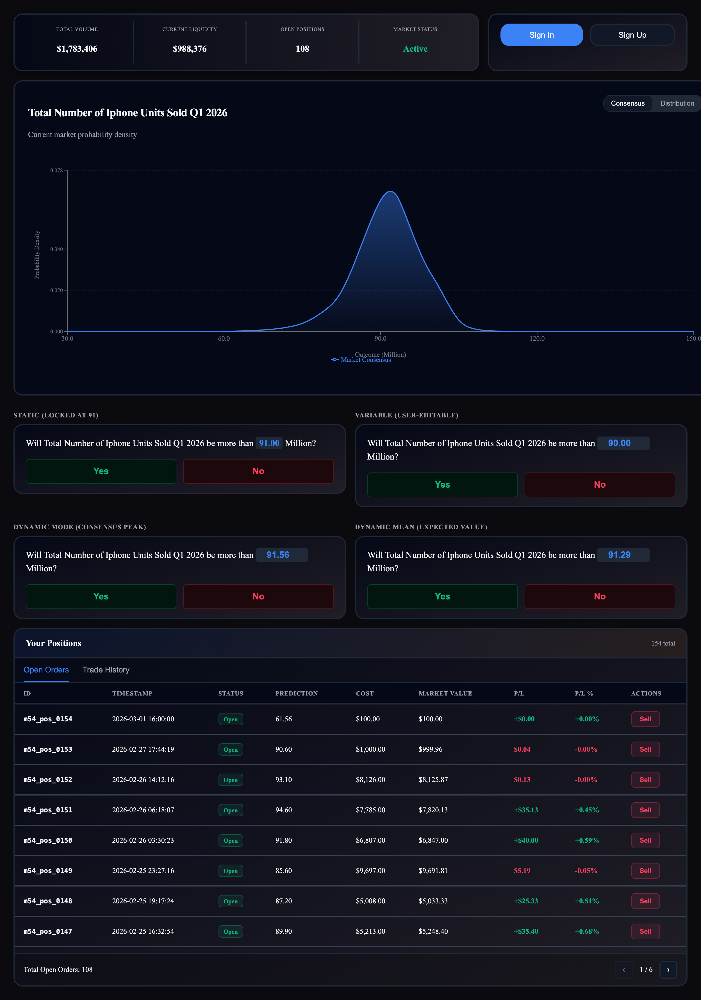

# Binary Panel

<figure><figcaption></figcaption></figure>

**File:** `demo-app/src/App_BinaryPanel.tsx`

Demonstrates the `BinaryPanel` in all four threshold modes simultaneously (static, variable, dynamic-mode, dynamic-mean), paired with a tabbed chart.

**Components:** `MarketStats` + `AuthWidget` → `MarketCharts` (consensus + distribution tabs) → 4x `BinaryPanel` (2x2 grid) → `PositionTable`

**What it enables:** The simplest possible trading UX. Users answer "Will X be more than Y?" — a familiar binary yes/no question. The chart provides context; the four panels demonstrate different threshold strategies.

**Target audience:** Casual users, non-financial audiences. Maximum accessibility.
