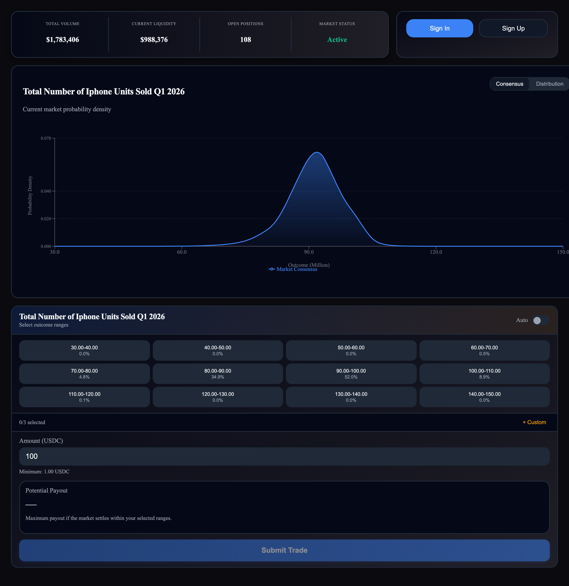

# Distribution Range

<figure><figcaption></figcaption></figure>

**File:** `demo-app/src/App_DistRange.tsx`

Trading against discrete probability buckets — the most approachable interface for range-based thinking.

**Components:** `MarketStats` + `AuthWidget` → `MarketCharts` (consensus + distribution tabs, with shared `distributionState`) → `BucketRangeSelector` (with shared `distributionState`)

**What it enables:** Users see probability mass per outcome range as a bar chart, then click bucket buttons to compose a bet. "I think there's a 40% chance it's between 48M and 52M" becomes a few button clicks. The chart's bucket count slider and the selector grid stay perfectly in sync through shared `useDistributionState`.

**Key pattern:** `useDistributionState` is called in the inner component and passed to both `MarketCharts` and `BucketRangeSelector` — demonstrating cross-component state sharing.

**Target audience:** Users who think in ranges rather than specific numbers. Compact layout suitable for sidebars.
