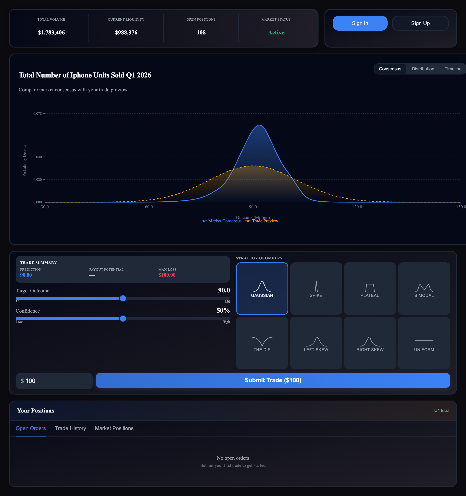

# Shape Cutter Trading Layout

<figure><figcaption></figcaption></figure>

**File:** `demo-app/src/App_ShapeCutterTradingLayout.tsx`

The 8-preset shape selector with a three-tab chart. The middle ground between TradePanel and CustomShapeEditor.

**Components:** `MarketStats` + `AuthWidget` → `MarketCharts` (consensus + distribution + timeline tabs, zoomable) → `ShapeCutter` → `PositionTable`

**What it enables:** Users choose from 8 belief geometries (Gaussian, Spike, Plateau, Bimodal, Dip, Left Skew, Right Skew, Uniform), tune parameters with sliders, and see their shape previewed on the consensus chart in real-time. The timeline tab shows historical consensus evolution — how stable or volatile the market has been.

**Target audience:** Intermediate traders who want expressive shapes without drag-and-drop complexity.
