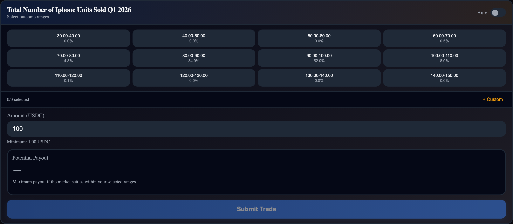

# BucketRangeSelector

**`BucketRangeSelector`**

A bucket-click trading interface. Displays outcome ranges as a grid of selectable buttons with probability percentages.

```tsx
import { BucketRangeSelector } from '@functionspace/ui';
```

<figure><figcaption></figcaption></figure>

**CSS class:** `fs-bucket-range`

**Props:**

<table><thead><tr><th>Prop</th><th>Type</th><th width="110.75390625">Default</th><th>Description</th></tr></thead><tbody><tr><td><code>marketId</code></td><td><code>string | number</code></td><td>required</td><td>Market to trade on</td></tr><tr><td><code>distributionState</code></td><td><code>DistributionState</code></td><td>--</td><td>External shared state (for syncing with <code>DistributionChart</code>). When omitted, creates its own via <code>useDistributionState</code>.</td></tr><tr><td><code>defaultBucketCount</code></td><td><code>number</code></td><td><code>12</code></td><td>Initial number of outcome buckets</td></tr><tr><td><code>maxSelections</code></td><td><code>number</code></td><td><code>3</code></td><td>Maximum simultaneously selected items (buckets + custom range combined)</td></tr><tr><td><code>defaultAutoMode</code></td><td><code>boolean</code></td><td><code>false</code></td><td>Start in auto mode (crops to 95% CI)</td></tr><tr><td><code>showCustomRange</code></td><td><code>boolean</code></td><td><code>true</code></td><td>Show custom min/max range input toggle</td></tr><tr><td><code>onBuy</code></td><td><code>(result: BuyResult) => void</code></td><td>--</td><td>Called after successful trade</td></tr></tbody></table>

**Behavior:**

* **Bucket grid:** Adaptive column layout — 3 columns for ≤9, 4 for ≤16, 5 for ≤25, 6 for >25. Each button shows the outcome range label and probability percentage. Clicking a selected bucket deselects it (toggle).
* **FIFO selection:** When `maxSelections` is reached, clicking a new bucket drops the oldest. Custom range selections count toward the max, reducing available bucket slots.
* **Auto mode:** Filters the grid to buckets within the 95% confidence interval (p2.5 to p97.5), focusing on active probability mass.
* **Custom range panel:** Collapsible inputs for min/max values with apply/clear buttons. Ranges are validated — out-of-bounds values are silently rejected (not clamped). Invalid inputs (NaN, min ≥ max, values outside the effective range) cause the apply action to do nothing.
* **Custom range panel:** Collapsible inputs for min/max values with apply/clear buttons. Ranges are validated — out-of-bounds values are rejected (not clamped), displaying an inline error.
* **Selection clearing:** Bucket selections reset automatically when bucket count or auto mode changes (because bucket boundaries shift).
* **Belief construction:** Builds via `generateRange` from the selected bucket and custom range boundaries.
* **Belief construction:** Generates belief via `generateRange` from the selected bucket and custom range boundaries.
* **Prediction:** The average midpoint of all selected ranges is passed to `buy()`.
* **Loading/error states:** Renders "Loading market data..." or "Error: {message}" when data is unavailable.

**Context interactions:**

* **Reads:** `ctx.client`
* **Writes:** `ctx.setPreviewBelief(belief)` on selection change, `ctx.setPreviewPayout(result)` after debounced projection, clears both on unmount
* **Triggers:** `ctx.invalidate(marketId)` after successful buy

**Internal calls:** `useDistributionState`, `generateRange`, `projectPayoutCurve`, `buy`

**Example:**

```tsx
<FunctionSpaceProvider config={config} theme="fs-dark">
  <BucketRangeSelector marketId={42} />
</FunctionSpaceProvider>
```

```tsx
// Shared state with a DistributionChart
const distState = useDistributionState(marketId, { defaultBucketCount: 8 });
<DistributionChart marketId={42} distributionState={distState} />
<BucketRangeSelector marketId={42} distributionState={distState} maxSelections={4} />
```

**Related:** `DistributionChart` (sync via shared `DistributionState`) | `BucketTradePanel` (composite of both) | `useDistributionState` (hook)

***
