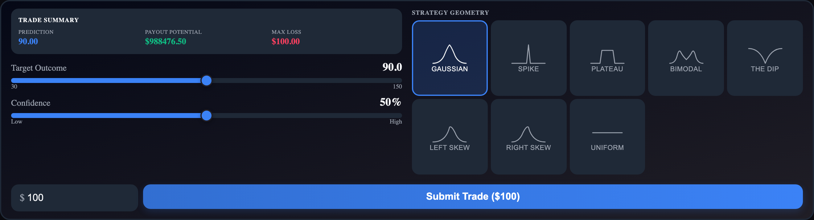

# ShapeCutter

**`ShapeCutter`**

A trading panel offering **8 distinct belief shape presets** with clickable SVG icon buttons. Adaptive parameter sliders change per shape.

```tsx
import { ShapeCutter } from '@functionspace/ui';
```

<figure><figcaption></figcaption></figure>

**CSS class:** `fs-shape-cutter`

**Props:**

| Prop           | Type                          | Default      | Description                   |
| -------------- | ----------------------------- | ------------ | ----------------------------- |
| `marketId`     | `string \| number`            | required     | Market to trade on            |
| `shapes`       | `ShapeId[]`                   | all 8        | Filter which shapes to offer  |
| `defaultShape` | `ShapeId`                     | `'gaussian'` | Pre-selected shape            |
| `onBuy`        | `(result: BuyResult) => void` | --           | Called after successful trade |
| `onError`      | `(error: Error) => void`      | --           | Called on trade failure       |

**Shape generators:**

| Shape      | Generator                                            | Key Parameters                                   |
| ---------- | ---------------------------------------------------- | ------------------------------------------------ |
| Gaussian   | `generateGaussian`                                   | Target outcome, confidence                       |
| Spike      | `generateGaussian` (with dynamic tighter multiplier) | Target outcome, confidence                       |
| Plateau    | `generatePlateau` (sharpness `1`)                    | Range (two-handle slider)                        |
| Bimodal    | `generateBelief` (two `PointRegion`s)                | Range (peak positions), confidence, peak balance |
| The Dip    | `generateDip`                                        | Target outcome, confidence                       |
| Left Skew  | `generateLeftSkew`                                   | Target outcome, confidence, skew intensity       |
| Right Skew | `generateRightSkew`                                  | Target outcome, confidence, skew intensity       |
| Uniform    | `generatePlateau(L, H, ...)` (full range)            | None                                             |

**Behavior:**

* **Layout:** Left column (trade summary, adaptive parameter sliders) + right column (shape icon grid, labeled "Strategy Geometry"). Amount input and submit button are in a footer below both columns.
* **Adaptive sliders:** Three fixed slider slots use `visibility: hidden` to prevent layout shifts. Each shape activates a different combination — target outcome or range, confidence, and shape-specific controls (peak balance for bimodal, skew intensity for left/right skew).
* **Trade summary:** Displays prediction, payout potential, and max loss (equal to collateral).
* **Confidence-to-spread mapping:** 0% = 20% of range (wide), 100% = 1% of range (narrow). Spike shape uses an additional dynamic multiplier for \~20x more range sensitivity.
* **Post-trade reset:** All parameters revert to defaults. The selected shape persists.

**Context interactions:**

* **Reads:** `ctx.client`
* **Writes:** `ctx.setPreviewBelief(belief)` on input change, `ctx.setPreviewPayout(result)` after debounced projection, clears both on unmount
* **Triggers:** `ctx.invalidate(marketId)` after successful buy

**Internal calls:** `useMarket`, `generateGaussian`, `generatePlateau`, `generateBelief`, `generateDip`, `generateLeftSkew`, `generateRightSkew`, `SHAPE_DEFINITIONS`, `projectPayoutCurve`, `buy`

**Example:**

```tsx
<FunctionSpaceProvider config={config} theme="fs-dark">
  <ShapeCutter marketId={42} />
</FunctionSpaceProvider>
```

```tsx
<ShapeCutter
  marketId={42}
  shapes={['gaussian', 'plateau', 'bimodal', 'dip']}
  defaultShape="bimodal"
  onBuy={(result) => console.log('Position:', result.positionId)}
/>
```

**Related:** `ConsensusChart` (renders preview overlay) | `SHAPE_DEFINITIONS` (shape metadata, icons) | `ShapeId` (exported type)

***
